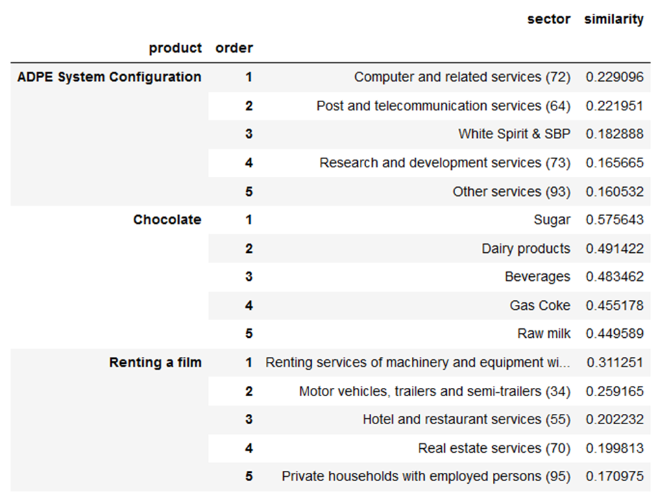

# Industrial Ecology Machine Learning Mapping
This Python module uses machine learning to map two classifications together, based on words similarity.

### Uses in Industrial Ecology
Industrial Ecology is a field of study where a lot of disciplines co-exists and often interacts. Mapping is thus 
typically required in IE projects to connect two databases. This module can assist in mapping to
- Sector classifications (NAICS, NACE, ISIC, etc.)
- Product classifications (NAPCS, CPC, CPA, etc.)
- Life Cycle Impact Assessment (LCIA) classifications (ReCiPe, EF3.0, IMPACT World+, CML, etc.)

## Installation
Install necessary module with pip
~~~
pip install -r requirements.txt
~~~

## Getting started
Choose a reference classification, a machine learning model and the amount of guess the algorithm will display.
~~~
self = ML_mapping.Mapping(reference_classification='exiobase',
                          transformer_model='all-MiniLM-L6-v2',
                          number_of_guesses=5)
~~~

Then enter the inputs you want to match to the reference classification, calculate similarity scores and format the 
results
~~~
self.match_inputs(['ADPE System Configuration','Chocolate','Renting a film'])
self.calculate_scores()
self.format_results()
~~~

The module returns:

## Classifications
The work for the following classifications has already been done in this module
- EIO/LCA databases
  - ecoinvent 3.8
  - ecoinvent 3.9
  - openIO-Canada
  - exiobase
  - USEEIO 2.0
  - GTAP 10
- Elementary flows classifications
  - ecoinvent 3.8
  - ecoinvent 3.9
  - IMPACT World+ 2.0
  - USEtox 2
  - EF 3.0
  - EF 3.1
- Product/Industry classifications
  - IOCC
  - NACE Rev.1.1
  - NACE Rev.2
  - CPA 2008
  - CPA 2.1
  - NAPCS 2017
  - NAPCS 2022
  - NAICS 2017
  - NAICS 2022
  - ISIC Rev.4
  - CPC 2.1
  - COICOP 2018

If the classification you want to match is not already covered, adding it is not complicated.

## Credit
This module is simply applying the work of https://github.com/UKPLab/sentence-transformers